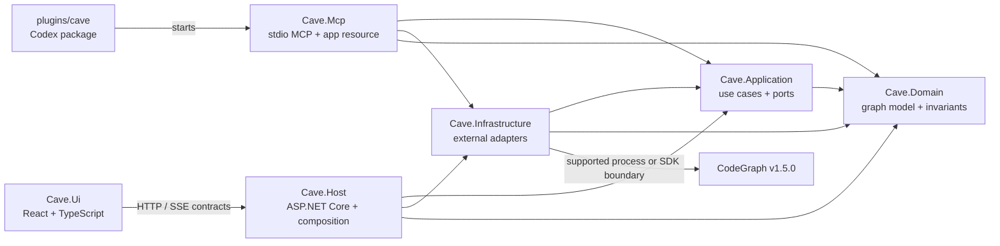

# CAVE architecture

CAVE (Codex Architecture Visualizer Engine) is a local-first architecture map for C# solutions. It combines semantic code structure, Git deltas, Codex activity, and explicitly recorded change intent without conflating those evidence sources.

The product requirements and gap analysis live in `docs/design/Codex_Architecture_Visualizer_Design.md`. This document records the accepted implementation architecture for this repository.

## Accepted stack

- Backend and composition root: ASP.NET Core 10 on stable .NET 10, written in C# 14.
- Frontend: React with strict TypeScript, React Flow, a presentation-only semantic projection, and a replaceable layout adapter. The canonical normalized snapshot remains unchanged while the UI aggregates it into System, Projects, Namespaces, or Classes views.
- Engineering workspace: `ArchitectureGraph` remains read-only CodeGraph evidence, while the writable `SemanticWorkspace` aggregate owns user/agent-authored engineering intent. Its stable entity ids are shared by diagrams and Kanban boards; those surfaces are projections over the same entities, relationships, content, tracking, and presentation records rather than duplicate task/card models. The canonical versioned document is persisted atomically at `.cave/semantic-workspace.json`; HTTP, MCP, JSON/human-readable export, and the React workspace are thin adapters over one application service and one validation path. Architecture bindings reference canonical graph node ids without copying or mutating CodeGraph evidence. Every write uses a cross-process lock plus optimistic revision compare-and-swap, so simultaneous HTTP/MCP updates cannot silently overwrite each other. Undo/redo is session-local and uses that same revision boundary, so stale or cross-process history fails closed rather than overwriting newer work.
- Presentation modes: Live activity is the initial project view. While it is selected, one prominent agent-activity spotlight owns the current agent phase, privacy-minimized work summary, and activity metrics. A tiny placement control moves that same spotlight between a floating canvas stage and the full-width top bar beside the theme control; the client persists the choice locally and refits the graph after the move. Canvas controls reserve the stage's footprint only while the canvas placement is active. Architecture and Changes remain explicit alternate modes without a competing activity panel. The selection inspector shares only the canvas row, so the workspace header and graph-mode controls remain full-width above both graph and inspector. Auto Live follows only the newest mapped activity batch for each active agent instead of the accumulated task history. Dense or cross-project work collapses to its active project representatives, filters unrelated nodes after semantic projection, and uses Tight layout spacing; small single-branch work may retain evidence-backed namespace/class detail. The standalone narrow-screen project view is a distinct three-part Live composition: a compact workspace/feed status strip, a prominent phase-and-summary agent narrative, and that same focused activity graph. A compact map button switches that same phone canvas to the existing full Projects projection and back, refitting after each change; the full-map state removes the narrative row to return its height to the canvas. The focused state never squeezes the full architecture into the canvas; idle or unmapped work is stated explicitly, while the canonical snapshot remains unchanged. One shared phase-aware agent avatar is reused by that spotlight, canvas badges, selection details, the machine dashboard, and the workspace rail: Working head-bobs in green, Editing head-bobs in amber, Thinking ponders with thought bubbles, Reading scans with animated eyes and glasses, Validating nods with a check, and completed work is static. Reduced-motion clients keep the same phase/accessory and color semantics without movement.
- Canvas readability: graph nodes keep their projection-owned width, height, and coordinates at every camera zoom. The frontend continuously derives a presentation-only readability factor from camera zoom in device-independent CSS pixels: icon, primary title, and indicators counter-scale within a bounded card-safe range while descriptions and metadata switch only between complete rows. Primary titles always reserve two complete rows; projection-owned card heights include that budget, and only labels whose balanced two-row form exceeds the base width receive a larger static width. Large usable canvas viewports retain secondary rows through farther overview zooms and slightly enlarge that copy, while the most distant view still reduces every card to its recognition essentials. Scaled navigation content reserves its transformed overflow as internal card clearance, and dotted or path-like identifiers receive separator-aware balanced wrap points instead of arbitrary fragment lines. `devicePixelRatio` is deliberately excluded because CSS pixels already normalize display density and multiplying it made overview text physically smaller on high-density displays. Camera movement updates inherited CSS variables directly so the graph does not relayout or re-render on every animation frame; React state is committed only when movement ends. Layout density is an explicit persisted presentation choice: Normal preserves the roomy default and Tight feeds reduced spacing into the same canonical ELK layout path without changing graph topology or node geometry.
- Hierarchy drill-down: project and namespace cards may open one focused presentation branch without changing the canonical graph. Revealed namespaces/classes use a compact nested card treatment; unrelated visible context and its routes remain present at 50% opacity.
- Project topology: the CodeGraph infrastructure adapter owns one canonical recursive manifest discovery path and classifies `.csproj` evidence into normalized `project-type:*` tags (test, class library, REST API, gRPC API, executable, WinForms, or WinUI). A descendant `.sln` or `.slnx` describes solution topology and never excludes that directory from the workspace; only a real nested Git worktree/submodule boundary or an explicit ignore rule may exclude sources. The frontend owns icon selection and may independently filter test projects plus their descendants or read-only NuGet package nodes from a projection without mutating the canonical graph.
- Semantic provider: CodeGraph v1.5.0, pinned and adapted behind an application-owned port.
- Documentation enrichment: CodeGraph remains the symbol authority, while its docstrings are narrowed to the declaration's primary XML `
` so parameter and remarks text cannot pollute node descriptions. A bounded C# source-trivia fallback reads only the contiguous `///` block immediately above a declaration when the provider omits that docstring; project descriptions come from `.csproj` or `package.json` metadata before generic type copy. The canonical graph retains the complete summary, and only the card presentation clamps it; hover and selection details expose the full text.
- Change truth: native Git commands behind an infrastructure adapter.
- Activity truth: privacy-minimized Codex lifecycle/tool hooks plus explicit `cave_set_scope` declarations, retained as independent evidence.
- Live browser updates: server-sent events.
- Codex integration: a .NET stdio MCP server and self-contained MCP App resource.
- Machine workspace catalog: one atomic record per observed repository under the current user's local application-data directory. Opaque workspace ids are derived from canonical paths; source repositories do not own this machine-level navigation state.
- Theme integration: the MCP App follows standard `McpUiHostContext.theme` initialization and `hostcontextchanged` notifications; the browser view follows the platform color scheme when no host context exists.
- Plugin: a repo-local Codex plugin under `plugins/cave`, with focused `init` and `open` skills for idempotent repository onboarding and browserless Codex entry, plus a separate `cave` skill for architecture inspection.

The design draft suggested a Node/TypeScript host. The user's explicit stack decision supersedes that suggestion. TypeScript remains the frontend language and may be used for a narrowly owned CodeGraph bridge only if the provider spike proves the .NET host cannot consume a supported structured interface directly.

## Compile-time ownership

Arrows mean “depends on.” Normal dependencies point inward; the host is the composition-root exception.

`Cave.Application` owns the semantic-index contract because it consumes semantic information. `Cave.Infrastructure` translates the external CodeGraph contract into CAVE domain records. No other project references CodeGraph types or its SQLite schema.

## Runtime evidence pipeline

```mermaid
flowchart LR
    CodeGraph["Static semantic truth"] --> Projection["Projection use case"]
    Git["Git change truth"] --> Projection
    Hooks["Observed Codex activity"] --> Events[".cave activity event stream"]
    Hooks --> Conversation["Opt-in .cave conversation stream"]
    Scope["cave_set_scope declarations"] --> Events
    Events --> Projection
    Events --> Compact["Compact activity projection"]
    Compact --> Display["GET /api/activity - external displays"]
    Conversation --> SharedWork["WorkspaceConversationService\nsharing + exact-task goal policy"]
    SharedWork --> Projection
    Compact --> LightFlow["WorkspaceAgentFlowService"]
    SharedWork --> LightFlow
    LightFlow --> LightApi["GET /api/agent-flow\nlight browser view + native devices"]
    Projection --> Snapshot["Architecture snapshot"]
    Snapshot --> API["HTTP + SSE"]
    Snapshot --> Tools["MCP tools + app polling"]
    Hooks --> Catalog["Machine workspace catalog"]
    Tools --> Catalog
    Catalog --> Dashboard["Browser project dashboard"]
    API --> UI["Browser UI\nsemantic view projection"]
    UI -->|"opt-in exact-task message"| Control["Durable conversation control queue"]
    Control -->|"validated thread/resume + turn/start"| AppServer["Local Codex App Server"]
    AppServer --> Conversation
    AppServer -->|"read-only thread/goal/get"| Goal["ICodexGoalProvider\nopt-in exact-task goal"]
    Goal --> SharedWork
    Tools --> UI2["Codex MCP App\nsemantic view projection"]
    UI2 --> HostChat["MCP Apps message + sampling"]
```

Each input retains source and confidence metadata. Static relationships are dependencies, never claimed as runtime data flow. Declared intent is never presented as independently observed fact.

Cross-stack HTTP integration is projected separately from compile-time CodeGraph evidence. When a TypeScript client uses a literal `fetch` or `EventSource` route that exactly matches an ASP.NET Core Minimal API route declaration, CAVE adds one consumer-to-provider `HttpApi` relation with `Inferred` confidence and the number of matched routes as its evidence count. This is a static contract dependency, not proof of runtime traffic.

Codex hook commands and the MCP server may run in different processes, so they communicate through atomic repository-local evidence files. The always-on `.cave/activity/inbox` stream remains privacy-minimized: it retains lifecycle metadata, tool identity, derived activity classification, and workspace-relative source paths, never prompt text, commands, tool payloads/responses, or assistant text. A distinct `.cave/conversation/inbox` stream activates only when the supported `.cave/conversation/settings.json` record explicitly enables sharing for that workspace. It captures only `UserPromptSubmit.prompt` plus final public `Stop`/`SubagentStop.last_assistant_message` values, with session/turn/agent identity, timestamps, truncation state, a 512-message count bound, and no system/developer instructions, tools, transcript ingestion, or reasoning. Invalid or missing settings fail closed; disabling sharing immediately hides retained content and prevents future capture without conflating conversation with architecture, Git, or activity truth. When Codex prepends an `<in-app-browser-context source="ambient-ui-state">` envelope, the hook removes only that exact leading host-supplied block and its generated `## My request:` separator before retention; Agent Flow therefore presents the actual user instruction while preserving identical markup authored elsewhere in the prompt.

The phase classifier maps observed instruction/start events to thinking and tool metadata to reading, editing, validating, or generic working; it does not infer thought from arbitrary silence. `UserPromptSubmit` also records a content-free activity marker so clients can advance the work-indicator presentation epoch. Read/search activity may identify inspected scope, but only events with objective mutation evidence produce recent-edit ripples. Activity paths map to exact semantic source locations first and then to the longest containing project; this keeps project-level activity visible when CodeGraph intentionally omits a source symbol kind such as a TypeScript function. The live monitor recognizes activity and conversation paths before its normal ignored-directory filter and performs a 120 ms live-overlay refresh, preserving the current CodeGraph and Git snapshots. Its change channel is the sole pending-event queue, and all full and overlay-only refreshes share one serialization gate so a slower projection cannot overwrite newer evidence. Git identity changes under `.git/HEAD`, `.git/packed-refs`, and `.git/refs/heads` trigger a full refresh so the overlay reports the current branch and exact HEAD alongside its comparison baseline. Work-indicator reset policy and cutoff are client-local presentation state: resetting decorations never deletes observed event evidence. Initialization may claim live hook connectivity only after correlating a journal event with the invoking `CODEX_SESSION_ID`; historical events prove prior connectivity, not that the current task is hooked. All consumers still receive one canonical versioned SSE/MCP snapshot stream.

Browser clients own one explicit SSE recovery loop. A failed initial snapshot request, stream-open timeout, malformed event, or disconnected stream closes the current attempt, reports visible reconnecting state, and retries continuously with a capped 500 ms to 5 s backoff. Every attempt refetches the selected workspace's canonical snapshot before reopening its scoped `/events` stream, so a returning host cannot leave the browser on stale state. Disposal cancels the active request, stream, and retry timer. This recovery reconnects to a returning host; it does not restart the host process or claim that Codex hooks can be registered retroactively in an already-running task.

Trusted-network browser chat uses a separate durable control journal under `.cave/conversation/control`. `POST /api/conversation/messages` resolves an opaque catalog workspace id, requires the browser's expected hook-observed session id, and persists the envelope before returning acceptance. The host waits for an observed main-task `Stop` or `SessionEnd`; the five-minute visual liveness lease never releases task ownership. A fresh local Codex App Server process must resolve the same thread id and session id through both `thread/read` and `thread/resume` before CAVE may call `turn/start`. Public `agentMessage` deltas and completion replace one stable journal record. Codex Desktop may retain the thread's exclusive writer briefly after the terminal hook: an `already has an active writer` rejection from `thread/resume` is therefore translated at the App Server boundary into a queued retry, because it occurs before `turn/start` and cannot duplicate an accepted prompt. The exact-task owner `Stop` hook may then claim that queued envelope. Its claiming Stop precedes the browser prompt, so the delivery remains `Running`. Codex can reuse the claiming turn id for the generated continuation; completion therefore correlates to the first retained main-agent `Final` for the exact session whose timestamp is strictly later than the claim, and copies that final's turn id to the delivery used by result dialogs. Legacy failed envelopes with that exact pre-acceptance error and no turn id are recovered through the same queue. Graceful host-stop recovery returns an interrupted App Server envelope to `Queued`; an owner-hook `Running` envelope remains owned by that hook until its retained answer is observed, while any other foreign `Running` record after a hard crash is failed without replay because Codex may already have accepted it. Unchanged status is not rewritten, preventing the one-second bridge scan from creating false SSE activity. Task identity mismatches and App Server failures with ambiguous acceptance become visible failed deliveries; CAVE never creates or selects a fallback task. Approval and user-input requests are currently declined rather than delegated to the unauthenticated browser.

Node-scoped **Explain this** and **Ask this box** interactions own dedicated modal lifecycles and never use the shared main-chat delivery queue. Embedded clients use host-advertised isolated sampling. Trusted-network browser clients revalidate the hook-bound task with App Server `thread/read`, create `thread/fork` with `ephemeral: true`, mark the returned session under `.cave/conversation/ephemeral`, run one turn on that in-memory fork, and return only the final assistant text to the modal. The marker makes hooks and both activity/conversation projections exclude that exact temporary session, including any already-written race record. The fork inherits relevant task context without adding a stored task, taking the main task writer, or publishing its prompt, activity, or response to shared workspace state. The Ask dialog collects the question first and then transitions to the isolated answer modal.

The standalone browser root is a machine dashboard. It polls `/api/workspaces` every two seconds for the small catalog/activity overview, and project selection supplies the opaque workspace id to `/api/snapshot` and `/events`. The host resolves that id through the catalog; the browser never supplies an arbitrary filesystem path. A separate `/activity` machine page keeps the dashboard intact and subscribes to the canonical scoped snapshot/SSE feeds for catalog workspaces that are active or were observed active during the current page visit. Project cards occupy append-only slots for that visit, so agent lifecycle changes cannot reorder projects, and an operator-persisted Grid/List preference controls whether wide screens render the stable slots side by side. It renders each privacy-minimized instruction marker as a project root and compares active agent duration using lifecycle timestamps, with at most three recent mapped-node/edit milestones between explicit start and current-phase nodes. When opt-in conversation sharing supplies a prompt whose session/turn identity exactly matches the instruction marker, the root shows a bounded preview and hover/focus exposes the full shared prompt; otherwise the root states that prompt text is not shared. Every milestone dot keeps a concise staggered label visible without requiring hover; hover/focus exposes its observed evidence and timestamp, never hidden model reasoning. Agent lanes reserve their full content width for the timeline while a nested progress segment preserves comparative duration. When work completes, the project timeline freezes, shows the matching public final response as its completion summary when available, and remains visible for at most ten minutes after the agent's last evidence; the operator may dismiss finished agents or a finished project sooner. Activity that begins again is retained anew. The global account quota spotlight belongs to the shared machine-page header and therefore appears on both overview and Agent flow, while model, reasoning effort, hidden reasoning, per-agent goal membership, and per-agent token attribution remain omitted until an authoritative contract supplies them. Fresh main-agent scope declarations are bound to the exact hook-observed task and legacy fresh declarations are projection-coalesced, so phase/scope evidence cannot materialize a duplicate main agent. Its project view owns a collapsible machine-navigation rail: compact mode shows icons and project monograms, while expanded mode shows full view and project names and refits the graph after the width change. The embedded MCP App omits this standalone navigation entirely because Codex already owns the surrounding navigation surface. The overview reuses the canonical repository activity reducer against an empty semantic graph, so active/idle/phase semantics cannot diverge from the graph view. Existing roots are project-navigable only when they contain the root-local `.codegraph/codegraph.db` workspace index; hook-observed global roots that only contain CodeGraph daemon/configuration state remain catalog evidence but cannot masquerade as projects. Missing directories remain visible as unavailable registrations rather than being silently deleted, and a later initialization makes an already-observed root visible without re-registration. An embedded MCP App bypasses the dashboard because `cave_show_architecture` already receives an explicit absolute workspace and returns that exact monitor subscription.

The activity-only external display feed is `GET /api/activity?workspace=<catalog-id>`. Its thin HTTP route resolves the existing machine catalog and invokes `WorkspaceActivityService`, which reuses `IAgentActivityStore` against an empty semantic graph. It never acquires a semantic monitor or includes graph, Git, or conversation content. Schema version 1 returns at most 32 agents, ordered active first and then by newest evidence with ordinal identity ties; `totalAgentCount` makes omission explicit. Feed generation time and actual latest evidence time remain separate. The canonical activity reducer now records latest state/phase provenance independently of summary provenance, so a newer observed tool event cannot make an older declared summary appear observed. Missing provenance remains null; historical observed/declaration flags are not used to infer it. Text is bounded for external transport (role 64, summary/name 160, diagnostic 512 UTF-16 characters); stable identities over 128 characters are rejected rather than truncated. This feed is an additive read projection for the n6 companion and does not change the canonical browser snapshot/SSE contract or activity lifecycle policy.

Agent liveness follows the newest observed lifecycle event or declared scope event for that identity; a newer `Stop`/`SubagentStop`/`SessionEnd` therefore supersedes an older active declaration, including a timestamp tie. Active state expires after a five-minute lease when a process or verification run fails to emit its closing event, preserving long reasoning phases without allowing abandoned work to pulse forever. Pathless lifecycle/tool events may refresh that liveness without erasing the latest mapped architecture location. A client reset clears every mapped node decoration before its cutoff, even when that agent still has fresh process-level activity; a later mapped event may place it again. Agent badges, working pulses, activity routes, and completed-work tint are Live-mode decorators only; Architecture and Changes modes remain free of activity-specific decoration.

Plugin lifecycle hooks are discovered only from `plugins/cave/hooks/hooks.json`, follow the documented Codex hook fields, and require Codex's explicit hook trust review after installation or definition changes. Codex resolves `PLUGIN_ROOT` when a task starts, so a plugin upgrade must not delete the only runner address held by an active task: the canonical installer preserves the small version-addressed hook runners, while the stable launcher falls back to the newest installed CAVE runner if its original cache path is unavailable. Activity and opt-in conversation writes are atomic and independently bounded. Active monitors reconcile both live overlays every two seconds so a dropped `FileSystemWatcher` notification cannot strand the view. Watcher overflow requests one full canonical refresh rather than introducing a second mutation path.

## Process and security model

Public-chat attribution is a frontend presentation responsibility. One `CodexText` renderer serves the conversation panel and isolated node answers; it decodes supported writing attributes, code comments, chat markers, suggestions and citation identifiers while preserving raw journal text and literal code examples. User prompts do not activate attribution directives, and no retained directive executes a host action. The tested external protocol and presentation limits are recorded in `docs/design/Codex_Compatibility.md`.

- `/api/workspaces` includes the operating-system host name so remote browser clients label the landing page with the machine actually serving CAVE rather than referring ambiguously to “this machine.”
- Machine presentation preferences belong to the browser that follows the generated links. `/settings/service-probes` owns the canonical name-versus-IP choice in `cave.probe-link-address`; every service-probe link must pass through the shared URL formatter, default to the machine name, and fail visibly rather than inventing an unreported name or IP address. Service probes and Fleet setup share the machine Settings navigation, while Fleet setup remains an explicit unavailable state until a real backend registration contract exists.

- Two thin .NET composition roots serve different host lifecycles: one per-user `Cave.Host` process for the machine dashboard plus workspace-scoped HTTP/SSE, and one `Cave.Mcp` stdio process per Codex integration. Both reuse the same application projection, CodeGraph adapter, per-workspace monitor registry, machine catalog contract, and TypeScript UI artifact.
- Each installed MCP process supervises the viewer with a bounded loopback compatibility probe against `/api/runtime`, starts the canonical per-user `%LOCALAPPDATA%\CAVE\viewer\Cave.Host.exe` installation when it is absent, and retries every five seconds if the viewer later disappears. The development installer refreshes that stable listener path from the newly installed plugin payload before restarting it; versioned plugin caches therefore do not create a new Windows Firewall application identity on every build. Viewer failure remains visible but does not take down embedded MCP tools. Concurrent tasks reuse only an exact viewer-protocol match; they do not install a Windows service, mutate machine network policy, or silently select another port/host implementation. The canonical development installer restarts only a verified CAVE-owned listener so an older cached build cannot survive an update.
- Hooks and monitor acquisition atomically refresh `%LOCALAPPDATA%\CAVE\workspaces\<workspace-id>.json`. One file per workspace prevents concurrent Codex processes from contending over a shared mutable registry file. Invalid catalog records are reported by the dashboard and do not hide valid projects.
- The machine host never infers a workspace by walking ancestors of its installation directory. A root enters the catalog only through an observed hook, an explicit MCP workspace, or the explicit `Cave:WorkspaceRoot` host setting; user-profile CodeGraph/configuration directories therefore cannot masquerade as projects.
- The repository-local `.cave` event stream is generated local state, never source or Git truth, and is ignored by version control and CodeGraph.
- The user-directed standalone-host default binds IPv4 `0.0.0.0:5098`; verification may override this with a private loopback URL.
- HTTP and SSE requests are unauthenticated on every bound interface. This is an explicit development-stage trusted-VPN operating mode, not an authentication boundary: operators must restrict port 5098 through loopback, Tailscale, or firewall policy and must not expose it directly to the public internet. At the user's direction, security hardening is deferred while the interaction contract is stabilized.
- Embedded chat checks host-advertised `message` and `sampling` capabilities, uses `ui/message` for a user-initiated message to the owning chat, and uses isolated `sampling/createMessage` requests for right-click node memos. The standalone browser additionally exposes opt-in conversation sharing plus durable exact-task `turn/start` for shared chat and ephemeral exact-task forks for node memos through the machine host; it does not expose arbitrary MCP tools, arbitrary paths, fallback task creation, or remote approval responses.
- Account usage is a read-only, cached infrastructure adapter over the documented local Codex App Server `account/usage/read` request. It reports an explicit unavailable state when the command, account, handshake, or response is unavailable and never changes thread ownership.
- Invalid configuration leaves health/configuration surfaces available and marks the affected subsystem unavailable; it does not silently select another semantic provider.

## Delivery sequence

1. Prove the .NET host and shared React UI with an explicitly labeled sample snapshot. Complete.
2. Complete the CodeGraph provider spike and replace the sample source in the normal mode. Complete.
3. Package the live graph as a Codex MCP App with app-private polling. Complete.
4. Enrich solution/project topology and architecture grouping. In progress.
5. Add Git overlays, hooks, scoped activity, and the structured journal. Git overlays, Codex hooks, observed activity, and explicit agent scope are complete; richer rationale/change-journal entries remain.
6. Add trusted-VPN read-only viewing and visual polish only after evidence quality is verified. VPN/LAN viewing is complete; visual polish continues.
7. Add opt-in public conversation mirroring, embedded chat write-back, isolated node memos, usage information, and experimental trusted-network exact-task browser write-back. In verification; authenticated/public-network hardening remains deferred.

Sample data is retained only as an explicit test/demo configuration. Normal browser and Codex plugin operation require the live CodeGraph provider and expose provider failures instead of recovering to sample or stale data.

## ADR: Current goals, agent focus, compact flow, and independent usage

`WorkspaceConversationService` owns opt-in conversation and read-only native goal enrichment for both the architecture snapshot and Agent Flow Light. It reads `thread/goal/get` through the application-owned `ICodexGoalProvider` and the infrastructure `CodexAppServerGoalProvider`. Only the exact `ConversationControl.SessionId` observed for this workspace is queried. CAVE never enumerates, resumes, starts, or mutates a task to obtain a goal. Disabled sharing and an absent exact binding omit goal data. After a potentially slow lookup, the service rechecks sharing and binding before publishing any objective. The cache retains at most 32 exact task entries for 15 seconds; it never substitutes a previous task's goal. No-goal and unavailable reads remain distinct. Native creation/update timestamps are retained as raw integers because their units are not documented. Goal and exact control changes use the canonical snapshot/SSE stream; retrieval-only timestamp changes do not advance its version. Explicit demo mode supplies synthetic goal data.

The UI shows a workspace's shared main goal separately from each agent's declared focus/subgoal. Codex's native goal has no structured subgoal field. Observed tool summaries stay labeled as observed actions. Goal text is gated again by sharing and matching task identity in the frontend. Architecture and Live views have a collapsible current-work panel; static architecture nodes retain their existing overlay policy. Agent flow adds a Compact view with a responsive agent list and native keyboard/touch timeline disclosures, while preserving the Timeline view and its Grid/List project layouts. Compact and Timeline use the same retained project lanes and terminal milestone projection. Mobile defaults to Compact unless the operator has persisted a different view choice.

`AgentDisplayNames` in Application owns deterministic single first names derived solely from original observed agent IDs. The requested pool is 48 female and 16 male names (75% female). Architecture snapshots attach `AgentActivity.DisplayName`; browser `agentIdentity.ts` consumes that supplied label, while unenriched activity keeps its explicit role label. Agent Flow Light uses the same owner. These are nonunique presentation names, not Codex account identities or declarations of role; original IDs remain authoritative in existing snapshot identity tooltips. Flow, work-context, spotlight, node-badge, inspector, and device views share these names.

## ADR: Agent Flow Light and portable resources

The user requested a dedicated API and resource pack for other apps, including STM32N6 companion displays. `GET /api/agent-flow?workspace=<catalog-id>` is a versioned external read contract owned by `WorkspaceAgentFlowService`; its thin Host route resolves the existing opaque catalog selection. It composes the existing `WorkspaceActivityService` projection with `WorkspaceConversationService`, without acquiring a graph or monitor, duplicating activity lifecycle policy, or adding a tracker. The existing activity-only feed remains its own supported external contract. The Light feed includes at most 32 rows and a 2048 UTF-16-unit main-goal objective with explicit truncation. `currentFocus` is populated only from declared summary evidence. Main-goal Private, Unbound, Ready and Unavailable states are distinct; Ready with null goal means no native goal. Activity, generation, and goal-retrieval timestamps remain separate. Live and Demo modes are explicitly labeled.

The Light feed hashes original agent IDs into full lowercase SHA256 row keys, preserving stable correlation without exposing native task IDs. Those keys cannot address a Codex task and do not replace canonical event identities. It returns no root paths, chat messages, graph, Git data, account identity, guessed per-agent goals or token attribution. Source errors become fixed safe diagnostics on this external transport; the original canonical sources retain their diagnostic evidence. Existing workspace conversation sharing governs main-goal text.

`resources/agent-flow-light` owns the portable schema, synthetic fixture, client guide, static assets, Node polling example, and fixed-buffer C client. Host embeds those source resources and the root MIT license at build time, serves the exact schema at `/api/agent-flow/schema`, and packages only embedded resources into `/api/agent-flow/resources`. No arbitrary filesystem path is accepted and no runtime source directory is required after publish. Clients need no browser. The C example owns parsing and bounded polling, while the consuming n6 app owns its HTTP, RTOS, graphics, board configuration, and firmware delivery. Host-compiler tests verify the portable parser; they do not establish on-device compatibility or deployment health.

The standalone React UI also exposes `/activity/light` for phone browsers. It selects one opaque workspace or aggregates all available catalog workspaces by polling each same `/api/agent-flow` contract with one request in flight per workspace, without requesting a semantic graph or duplicating activity or goal projection. A failed feed read clears that workspace's previously shared goal text. The full `/activity` timeline remains a separate view over the canonical snapshot/SSE stream.

The canonical activity reducer preserves the last meaningful observed work action separately from lifecycle-only completion hooks and derives a subagent's exact parent from the hook-observed session identity. Application hashes parent and agent identities through one owner for the Light feed; `parentAgentId` and `lastObservedActivity` are additive, optional version-1 fields in the portable resource schema. The canonical browser snapshot adds the same opaque public correlation key while preserving raw internal identity. A phone can open the exact recent agent's ordered timeline list with that key. Finished rows expire from both browser views within ten minutes of their last evidence and can be dismissed earlier without ending a Codex task. Device clients apply their own display retention.

Account token activity and rate-limit reads are independent requests in the existing App Server usage adapter. A successful source is retained when the other fails; `Ready` with a diagnostic reports partial availability, while both failed sources remain `Unavailable`. Null fields remain unknown, including `ordinaryUsageAllowed`; zero usage is a reported value. The usage spotlight identifies the limiting included Codex window and respects the backend permission result. Shared machine pages refresh account information every 60 seconds with cancellation and no overlapping requests. Completed unavailable responses render diagnostics rather than remaining labeled as loading.
