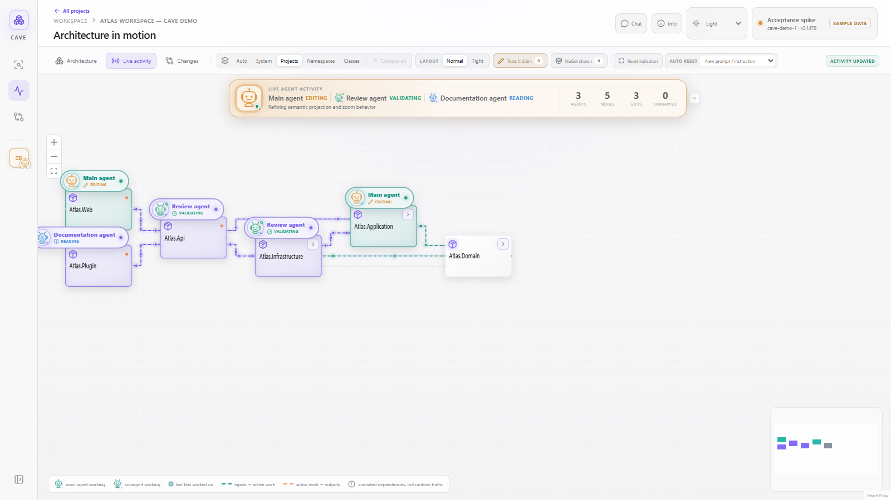
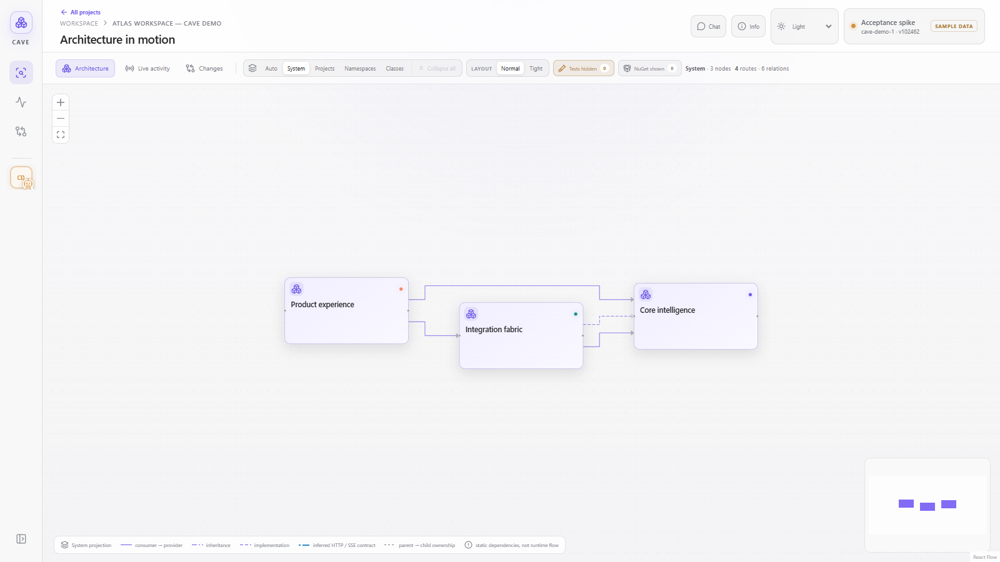
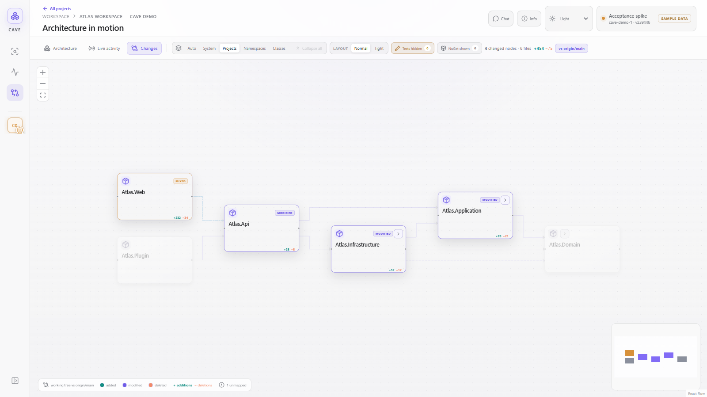
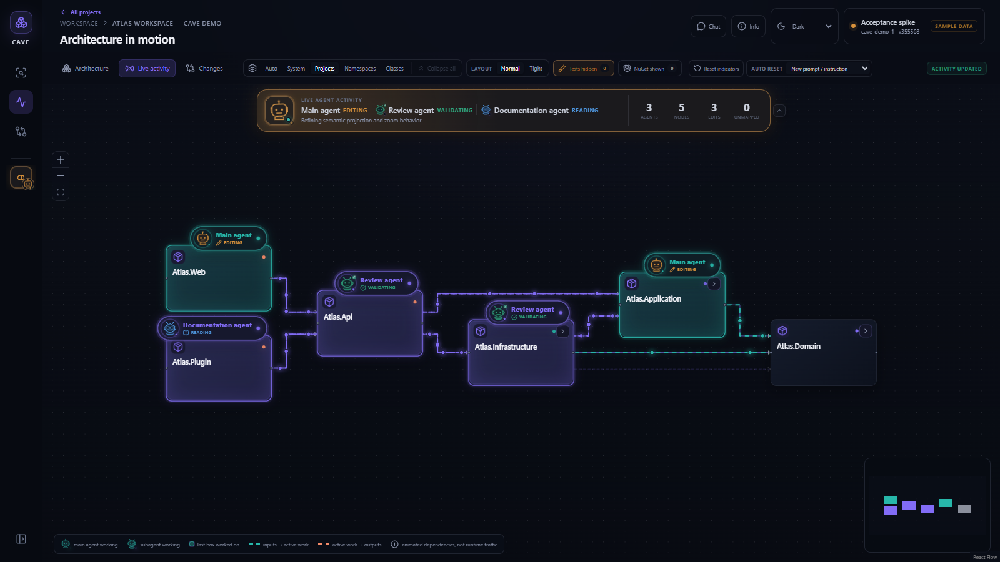
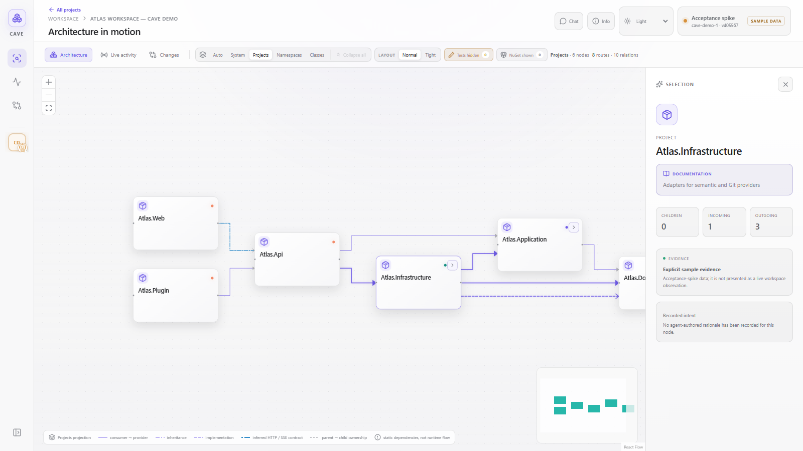

# CAVE

[](https://github.com/MartinGroh/Codex-Architecture-Visualizer-Engine/actions/workflows/ci.yml)
[](https://github.com/MartinGroh/Codex-Architecture-Visualizer-Engine/actions/workflows/public-readiness.yml)
[](https://github.com/MartinGroh/Codex-Architecture-Visualizer-Engine/actions/workflows/codeql.yml)
[](https://github.com/MartinGroh/Codex-Architecture-Visualizer-Engine/actions/workflows/secret-scan.yml)
[](https://github.com/MartinGroh/Codex-Architecture-Visualizer-Engine/releases)
[](LICENSE)
[](global.json)
[](src/Cave.Ui/package.json)
[](src/Cave.Ui/tsconfig.app.json)

Codex Architecture Visualizer Engine (CAVE) is a local-first map of a software system while Codex is working on it. It keeps semantic architecture, Git changes, agent activity, and explicitly shared conversation as separate evidence, then brings them together in one interactive graph.

> Pre-release source: source review, clean history, and GitHub-generated commit email privacy are recorded in the [public-release checklist](docs/security/PUBLIC_RELEASE_CHECKLIST.md). Binary releases and Codex Plugins Directory publication have separate approval and verification gates.



## What it shows

- Architecture at system, project, namespace, and class levels.
- Exact Git baseline and worktree changes mapped onto architecture nodes.
- Live main-agent and subagent activity without storing prompts, reasoning, commands, or tool results.
- An opt-in public conversation journal containing only user prompts and final replies.
- An embedded Codex MCP App plus a trusted-network browser workspace with exact-task chat and editable engineering intent.
- Selection details, change impact, semantic routes, dark mode, and responsive layouts.

[Watch the 37-second overview](docs/media/cave-overview.mp4) · [Watch the 26-second drill-down](docs/media/cave-drilldown.mp4) · [Browse all demo media](docs/wiki/Demo-and-Media.md)

<p>
  
  
</p>
<p>
  
  
</p>

## Try the safe demo

The demo is the fastest path to a useful CAVE screen. It is an explicit composition mode: graph, Git, activity, conversation, and usage providers all return synthetic Atlas data. Demo mode is never selected as a fallback for a failed live provider and does not inspect another repository.

### 1. Install prerequisites

- Windows 10 or 11 and PowerShell 7.
- [.NET SDK 10.0.303](global.json), or a compatible stable 10.0 patch.
- Node.js 24 or another version supported by the checked-in frontend toolchain.

### 2. Clone and start

```powershell
git clone https://github.com/MartinGroh/Codex-Architecture-Visualizer-Engine.git
Set-Location './Codex-Architecture-Visualizer-Engine'
pwsh ./scripts/start-demo.ps1
```

CAVE builds both stacks, starts on `http://127.0.0.1:5096`, and opens the generated demo workspace. Press `Ctrl+C` in that terminal to stop it.

For a faster repeat run after a successful build:

```powershell
pwsh ./scripts/start-demo.ps1 -SkipBuild
```

### 3. Explore

1. Switch between **Architecture**, **Live activity**, and **Changes**.
2. Select **System**, **Projects**, **Namespaces**, or **Classes**.
3. Click a card for provenance, inputs, outputs, and activity.
4. Open **Chat** and **Info** to see read-only synthetic demo content.
5. Switch the theme to **Dark**.

## Use CAVE with a real workspace

Real mode additionally requires:

- Codex CLI or the Codex desktop app.
- CodeGraph 1.5.0, preferably its official standalone Windows bundle.
- Python 3.11 or newer for the isolated plugin validator.

From the CAVE repository root:

```powershell
npm --prefix src/Cave.Ui ci
pwsh ./scripts/install-local-plugin.ps1
pwsh ./scripts/verify.ps1
```

Then start a new Codex task in the repository you want to inspect:

1. Review and trust the installed CAVE hooks in `/hooks`.
2. Run `/cave:init` (or invoke `$cave:init`) once.
3. Run `/cave:open` whenever you want to reopen the live graph.

The installer builds the self-contained MCP App, publishes the .NET host and stdio server, validates the plugin, installs `cave@personal`, and refreshes a stable per-user viewer. The initializer creates only ignored `.codegraph/` and `.cave/` state in the observed workspace.

## Privacy and network boundary

CAVE is local-first, but architecture and activity metadata can still be sensitive.

- Conversation sharing is off by default and must be enabled per workspace.
- Hook activity stores event, agent, phase, and bounded path metadata—not prompt text, replies, commands, tool payloads, or reasoning.
- `.codegraph/`, `.cave/`, generated plugin binaries, captures, and machine catalogs are ignored.
- The browser host has no HTTP authentication. Use it only on loopback or a trusted, restricted network; never publish port `5098` to the internet.
- Browser access can change conversation sharing, queue a message for the exact hook-bound Codex task, run isolated node questions, and edit the semantic workspace. Task identity checks and revision checks protect routing and concurrent edits; they do not authenticate the caller. Restrict access to people authorized for those operations.
- Run `pwsh ./scripts/audit-public-readiness.ps1 -IncludeHistory` before sharing source. Inspect the actual package separately before a binary release.

See [Security](SECURITY.md), the [privacy model](docs/wiki/Security-and-Privacy.md), and the [release checklist](docs/security/PUBLIC_RELEASE_CHECKLIST.md).

The latest source and history assessment is recorded in [Public readiness](docs/release/PUBLIC_READINESS.md).

Codex 0.157 integration checks and the supported public-chat text formats are documented in [Codex compatibility](docs/design/Codex_Compatibility.md). Changed plugin hooks require review through `/hooks` after installation.

## Develop and verify

```powershell
npm --prefix src/Cave.Ui ci
npm --prefix src/Cave.Ui run lint
npm --prefix src/Cave.Ui run test
npm --prefix src/Cave.Ui run build
dotnet build CAVE.slnx
dotnet test CAVE.slnx --no-build
pwsh ./scripts/audit-public-readiness.ps1
```

The canonical full verification path is:

```powershell
pwsh ./scripts/verify.ps1
```

For frontend hot reload, start the .NET host and Vite separately:

```powershell
npm --prefix src/Cave.Ui run build
dotnet run --project src/Cave.Host -- --Cave:WorkspaceRoot="$PWD"
npm --prefix src/Cave.Ui run dev
```

## Architecture

Dependencies point inward:

```text
UI / Host / MCP
       │
Infrastructure adapters
       │
Application use cases and ports
       │
Domain graph and invariants
```

```text
src/Cave.Domain          stable graph concepts and invariants
src/Cave.Application     use cases and consumer-owned ports
src/Cave.Infrastructure  semantic, Git, activity, and process adapters
src/Cave.Host            ASP.NET Core composition and HTTP/SSE transport
src/Cave.Mcp             Codex stdio MCP composition and app resource
src/Cave.Ui              React/TypeScript visualization
tests/Cave.Tests         backend and host tests
plugins/cave             distributable Codex plugin source
docs                     design, decisions, wiki, release, and security docs
```

Read [Architecture.md](Architecture.md) for CAVE's accepted boundaries and [ArchitectureAndCodeGuidlines.md](ArchitectureAndCodeGuidlines.md) for the reusable, organization-neutral engineering rules. Product intent lives in [the design document](docs/design/Codex_Architecture_Visualizer_Design.md); intentional deviations live under [docs/decisions](docs/decisions).

## Contribute

Start with [CONTRIBUTING.md](CONTRIBUTING.md), the [Code of Conduct](CODE_OF_CONDUCT.md), and the [Wanted page](WANTED.md). Architectural changes should open a design issue before implementation. Follow [SECURITY.md](SECURITY.md) for confidential vulnerability reporting.

Project decisions follow [GOVERNANCE.md](GOVERNANCE.md). Releases use semantic versioning, a checked-in [VERSION](VERSION), and the process in [docs/release/RELEASE_PROCESS.md](docs/release/RELEASE_PROCESS.md). Publishing to the Codex Plugins Directory remains an explicit human approval step.

## License

CAVE is available under the [MIT License](LICENSE).
