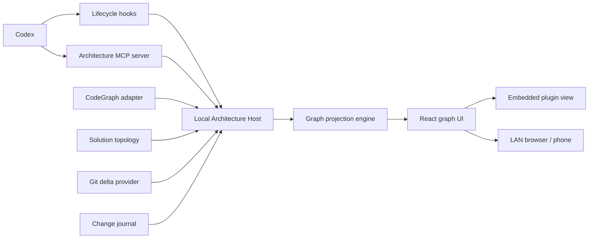

# Codex Architecture Visualizer

**Design and CodeGraph gap analysis**  
**Status:** Draft v0.1  
**Date:** 2026-08-16

> **Implementation amendment (2026-08-17):** The explicit product direction now requires one per-user machine viewer that can outlive an individual Codex task and list every workspace observed by the installed plugin. The accepted implementation therefore promotes the local HTTP host to an on-demand background process, backed by a machine-local workspace catalog. The browser root is the project dashboard; selecting a project opens its scoped graph. The embedded Codex MCP App still opens the explicitly requested workspace directly. This supersedes the v1 statements below that a standalone daemon is unnecessary, while preserving the separation of graph and observed evidence.
>
> **Security amendment (2026-09-26):** The accepted architecture now includes trusted-network HTTP writes for conversation sharing, exact-task chat, isolated node questions, and semantic-workspace operations plus undo/redo. The operator-selected host still binds `0.0.0.0:5098` without HTTP authentication and relies on operator-managed VPN/firewall policy to restrict callers. Task binding and optimistic revisions protect routing and data consistency, not caller identity. This supersedes the original read-only browser proposal and token requirement in section 18.3 and ADR-005. It does not authorize public-internet service exposure; authentication and public-network hardening remain deferred. `Architecture.md` records the current implementation contract.

## 1. Decision summary

Build the first version around **CodeGraph (`colbymchenry/codegraph`) as the semantic code engine**, but place it behind our own narrow semantic-index abstraction. Do not let CodeGraph types, database schema, or visualization concepts become our domain model.

The product has three parts:

1. **Semantic/architecture engine** - CodeGraph plus a thin solution/project enrichment layer and our normalized architecture graph.
2. **Codex plugin + visualization** - the primary integration. Codex lifecycle hooks provide live activity, plugin tools record intent and expose graph/context, and one visually strong graph UI renders architecture, change state and activity.
3. **Local host / external viewer** - the same UI is served from the plugin's local host so a phone or browser on a trusted network can monitor a running task, send exact-task chat, ask isolated node questions, and edit semantic engineering intent.

The stack requires **no additional paid subscription or hosted service**. CodeGraph is MIT licensed and runs locally. Git is the source of change truth. The Codex plugin/hook infrastructure is the integration point already present in Codex. The UI can use the open-source React Flow core; an open-source layout engine is plugged in behind an adapter.

### Architectural rule

> **Static code truth, Git truth, agent activity, and model-authored intent are separate data sources.**
>
> The UI composes them as overlays. It never treats model-generated intent as structural truth, and it never presents a static dependency edge as runtime data flow.

That separation is the main protection against the visualizer becoming convincing but wrong.

---

## 2. Product goal

Provide a continuously understandable visual map of a medium-to-large software solution while Codex is working on it.

The viewer should answer, at a glance:

- What are the major architectural areas?
- What project/namespace/class is Codex working on now?
- Are subagents active, and what scope have they claimed?
- What has changed relative to the selected Git baseline?
- Is the current change mainly adding, modifying, or removing code?
- What other architecture areas depend on the changed area?
- What did a class or namespace gain, modify, or remove?
- Why did Codex make a particular change, when that intent has been recorded?

The primary target is a **C# solution containing multiple projects and hierarchical namespaces**. C++ should remain possible through the semantic provider abstraction, but is not required to drive the first implementation.

---

## 3. Non-goals for v1

The first version should **not** attempt to become:

- a source-code editor;
- a full UML modeling product;
- a replacement for Git;
- a runtime distributed tracing system;
- a general-purpose observability platform;
- a method-level graph browser;
- an autonomous architecture classifier that silently decides what the system means;
- a second AI service with its own API subscription.

Methods/functions exist in the internal symbol index and in detail panels, but **classes are the normal leaf nodes of the architecture graph**.

---

## 4. Target architecture



### 4.1 Process model

Use one local **Architecture Host** process started by the Codex plugin.

The host performs four jobs:

- owns/opens the CodeGraph index;
- consumes Codex hook events;
- computes Git/change overlays and graph projections;
- serves both the MCP/plugin integration and the local HTTP UI/API.

This avoids introducing a separate daemon for v1. The phone monitor only needs to exist while the Codex session is running, so a second lifecycle is unnecessary.

If later we need the viewer to remain available independently of Codex, the same host can be promoted to a background service without changing the domain model or UI protocol.

### 4.2 Suggested implementation split

Keep the repository physically simple at first:

```text
/src
  /host                 local HTTP + SSE + MCP server
  /semantic             normalized model + CodeGraph adapter
  /solution             .sln/.csproj topology enrichment
  /git                  baseline, diff and symbol delta mapping
  /codex                hook handlers + plugin tools
  /projection           grouping, aggregation, focus and zoom projection
  /journal              structured intent/change journal
  /ui                   React application
/plugin
  /.codex-plugin
  /hooks
  /skills
```

Do not split this into separately versioned services/packages until there is an actual need.

---

## 5. Why CodeGraph is a good v1 engine

The current CodeGraph repository is materially better aligned with this design than a plain dependency parser.

It provides:

- local code indexing into SQLite;
- C# and C/C++ support;
- symbol kinds including namespace, class, interface, method, property, field and file;
- relation kinds including contains, calls, imports, extends, implements, references, instantiates and overrides;
- source line ranges for indexed symbols;
- callers/callees, path/impact-style graph traversal;
- incremental file watching/synchronization;
- a public TypeScript/Node API rather than requiring us to scrape its MCP output or SQLite schema directly.

CodeGraph uses tree-sitter based extraction plus its own cross-file resolver. This is useful semantic structure, but it is **not the same thing as compiler-authoritative Roslyn semantics**. Dynamic dispatch, reflection, dependency injection and framework convention remain areas where static inference can be incomplete.

### 5.1 Integration decision

Create a narrow provider boundary such as:

```ts
interface ISemanticIndex {
  initialize(root: string): Promise<void>;
  getSymbols(filter?: SymbolFilter): Promise<SemanticSymbol[]>;
  getRelations(filter?: RelationFilter): Promise<SemanticRelation[]>;
  getSymbol(id: SymbolId): Promise<SemanticSymbol | undefined>;
  getImpact(id: SymbolId, depth: number): Promise<ImpactResult>;
  subscribe(callback: (change: SemanticIndexChange) => void): Disposable;
}
```

`CodeGraphSemanticIndex` is the v1 implementation.

The rest of the application consumes **our** `SemanticSymbol` and `SemanticRelation`, never CodeGraph's public or database types directly.

### 5.2 Do not query CodeGraph SQLite directly in v1

CodeGraph exposes lower-level database helpers, but its supported programmatic facade is the safer boundary. Direct database access saves very little initially and couples us to a schema we do not own.

If profiling later identifies the facade as a performance bottleneck, database access can be introduced **inside the adapter only**.

### 5.3 Pin a tested CodeGraph version

CodeGraph is evolving quickly. Treat it as a library dependency with an explicitly tested version rather than following `main` automatically.

---

## 6. CodeGraph gap analysis

| Requirement | CodeGraph contribution | Gap / our responsibility | v1 decision |
|---|---|---|---|
| C# files, classes, interfaces, methods | Native structural extraction | Normalize into our IDs/types | Use directly |
| Hierarchical namespaces | `namespace` node kind and containment | Canonical project-aware namespace tree | Build thin normalizer |
| Class inheritance | `extends` | Visual semantics and aggregation | Use directly |
| Interface implementation | `implements` | Visual semantics and aggregation | Use directly |
| Calls/references/imports | Native graph edges | Collapse into understandable architecture dependencies | Build projection rules |
| Impact/blast radius | Graph traversal available | Aggregate to current zoom level | Use as impact provider |
| Incremental source changes | Watch/sync support | Coordinate with hook/UI latency | Use directly |
| Source line ranges | Available on indexed nodes | Map Git hunks to symbols | Build mapper |
| `.sln` solution structure | No project/solution node kind in the published graph model | Discover projects and solution membership | Build small solution enricher |
| `.csproj` project references | Not represented as a first-class published edge kind | Parse project references | Build small solution enricher |
| Project role: Core/API/UI/Hardware/etc. | Not semantic analyzer responsibility | User-defined classification + optional suggestions | Build config layer |
| XML `/// <summary>` class docs | Not a documented CodeGraph output contract | Extract source documentation | Small C# enrichment |
| `abstract` visual classification | Base class relationships are available; modifier contract needs verification | Extract/normalize modifiers where needed | Spike; enrich if missing |
| C# partial classes | Exact logical merge behavior needs verification | Merge declarations into logical type when needed | Spike |
| Exact Roslyn overload semantics | Tree-sitter/resolver, not compiler semantic model | Accuracy gap in edge cases | Accept v1; keep provider replaceable |
| Reflection/DI/runtime wiring | Partial/static inference only | Cannot claim complete runtime truth | Mark confidence; optional future provider |
| Git `+N -M` | None | Git provider | Build using native Git |
| Class-level Git `+N -M` | Symbol ranges help | Hunk-to-symbol mapping; deleted symbols are harder | Build best-effort v1, improve later |
| Live Codex activity | None | Codex hooks | Build plugin hook bridge |
| Subagent lifecycle | None | Codex `SubagentStart/Stop` | Use directly |
| Exact subagent -> every file edit attribution | Not CodeGraph; Codex tool hook schema does not expose `agent_id` on normal tool events | Need declared scope or future host support | Best-effort / explicit scope |
| Add/modify/remove structural change | None | Git + symbol comparison | Build deterministic overlay |
| Change intent / rationale | None | Agent-authored structured journal | Build plugin tool |
| Semantic zoom | None | Projection/UI concern | Build |
| Top-level aggregated dependencies | Raw semantic edges | Aggregate descendant edges | Build projection engine |
| Phone/LAN workspace | None | Local host + responsive UI and explicit control endpoints | Trusted-network monitoring, exact-task chat, and semantic-workspace edits |
| Runtime data flow | Static graph is insufficient | Would require runtime instrumentation | Explicit non-goal |

### Conclusion from the gap analysis

**The hard missing pieces are product semantics, not code parsing.**

We do not need to replace CodeGraph or start with SCIP/Roslyn. We need to add:

1. solution/project topology;
2. architecture grouping;
3. Git delta mapping;
4. Codex activity/intent;
5. graph aggregation/projection;
6. a strong visual language.

That is a reasonable amount of project-specific work and is exactly where this product should differentiate.

---

## 7. Normalized architecture model

Do not create one giant mutable node object containing every possible state. Separate the stable base graph from overlays.

### 7.1 Base nodes

```ts
type ArchitectureNodeKind =
  | "architecture-group"
  | "project"
  | "namespace"
  | "class"
  | "interface"
  | "abstract-class";

interface ArchitectureNode {
  id: string;
  kind: ArchitectureNodeKind;
  parentId?: string;
  name: string;
  qualifiedName?: string;
  description?: string;
  source?: SourceLocation[];
  semanticIds: string[];
  categoryId?: string;
  tags: string[];
}
```

Important C# detail: namespace/type IDs should include the **project/assembly context**. The same namespace name can exist in several projects.

A useful logical identity is approximately:

```text
project:<relative-project-path>/namespace:<fqn>/type:<fqn>
```

Partial class declarations should eventually map to one logical class node with several `SourceLocation` entries.

### 7.2 Base relations

```ts
type ArchitectureRelationKind =
  | "contains"
  | "depends-on"
  | "inherits"
  | "implements"
  | "project-reference";

interface ArchitectureRelation {
  id: string;
  sourceId: string;
  targetId: string;
  kind: ArchitectureRelationKind;
  weight: number;
  evidenceCount: number;
  confidence: "exact" | "inferred" | "heuristic";
}
```

The normalizer maps CodeGraph's lower-level `calls`, `imports`, `references` and `instantiates` relations into a smaller set of visual relations. The original evidence remains available for drill-down.

### 7.3 Overlays

Use independent overlays rather than modifying the base graph:

- `GitDeltaOverlay`
- `AgentActivityOverlay`
- `ChangeIntentOverlay`
- `ImpactOverlay`
- `FocusOverlay`
- `SelectionOverlay`

This is what makes new visual cues additive instead of invasive.

---

## 8. Solution and architecture grouping

### 8.1 Solution topology

For C# the visual hierarchy should be:

```text
Solution
  -> Architecture group
    -> Project
      -> Namespace hierarchy
        -> Class / Interface / Abstract class
```

A project may be shown directly under the solution if it has no configured architecture group.

The solution enricher only needs to provide:

- solution membership;
- project names/paths;
- project references;
- target/framework metadata if useful later.

Avoid embedding MSBuild or implementing a full project-system evaluator in v1. Parse the solution/project topology that is needed for visualization. Escalate to `Microsoft.Build.Graph` only if real repositories demonstrate that basic project parsing is insufficient.

### 8.2 Architecture groups

Architecture groups are a **user-owned semantic layer**, for example:

- Core / Business Logic
- Hardware & Communication
- Data / Domain Model
- API / Exposure
- CLI / Tools
- UI / WinForms

Persist explicit rules in a small repository config, for example:

```json
{
  "groups": [
    {
      "id": "hardware",
      "name": "Hardware & Communication",
      "icon": "cpu",
      "theme": "violet",
      "projectPatterns": ["*.Hardware.*", "*.Communication.*"],
      "namespacePatterns": ["*.Hardware.**"]
    }
  ]
}
```

The system may later **suggest** groups based on project names, references and namespace prefixes, but it should never silently rewrite the user's architecture classification.

---

## 9. Semantic zoom and graph projection

This is the central UI behavior.

The canonical graph remains detailed. The UI does not merely hide nodes as the user zooms out; it asks a **projection engine** for a graph appropriate to the current semantic level.

### 9.1 Suggested levels

**Level A - System view**  
Architecture groups and major ungrouped projects.

**Level B - Area view**  
Projects and major namespace roots inside the focused architecture group.

**Level C - Namespace view**  
Namespace hierarchy plus relevant classes/interfaces.

**Level D - Class view**  
Classes/interfaces are fully expanded; methods remain in the detail panel, not the canvas.

### 9.2 Dynamic zoom with manual override

Support both behaviors discussed:

- **Automatic semantic zoom** based on camera zoom.
- **Manual level lock** such as System / Projects / Namespaces / Classes.

Automatic transitions should have hysteresis/debounce so the graph does not relayout continuously around a threshold.

When the semantic level changes, preserve the current focal node and camera anchor.

Camera zoom inside a selected semantic level must not mutate layout geometry. Node width, height, and graph coordinates remain fixed while a continuous, presentation-only readability policy counter-scales the icon, primary title, and status indicators and progressively collapses secondary copy. The policy uses effective device-pixel zoom (`camera zoom * devicePixelRatio`), so a denser display retains the normal information hierarchy farther out. Apply the interpolated values through inherited canvas CSS variables during camera movement; do not re-run layout or commit React state on every animation frame.

### 9.3 Context should fade, not disappear

When the user focuses a group/namespace/class:

- focused nodes remain fully opaque;
- direct dependencies/dependents remain visible but quieter;
- unrelated architecture stays on the canvas at low opacity;
- edges outside the focus become thin/subdued rather than being removed entirely.

This preserves the mental map of the solution.

### 9.4 Aggregating edges

For every detailed relation `A -> B`, map each endpoint to its nearest currently visible ancestor.

```text
visibleSource = visibleAncestor(A)
visibleTarget = visibleAncestor(B)
```

Relations resolving to the same visible pair are collapsed into one weighted edge.

This gives us the desired behavior where **top-level boxes still show meaningful relationships**, even though the underlying calls/references happen between classes several levels below.

---

## 10. Edge semantics and animation

Animated edges are useful only if their meaning is unambiguous. Use different visual semantics for different concepts.

### 10.1 Static dependency direction

For static architecture dependencies, use:

```text
Consumer -> Provider
```

Example:

```text
Core -> Hardware Communication
```

means **Core depends on / consumes Hardware Communication**.

This aligns with the desired mental model of an arrow pointing toward the thing being used.

### 10.2 Impact direction

Impact is the reverse question: “if this changed, what may need adapting?”

Render a temporary/animated **impact overlay**:

```text
Changed node -> Dependent node
```

Example:

```text
Data Model => Core => API => UI
```

This is not the same edge semantics as the base dependency graph, so it must use a different line treatment/animation and an explicit legend.

### 10.3 Do not call static dependencies “data flow”

CodeGraph tells us structural/static relationships. It does not prove that runtime data is currently moving over an edge.

Therefore v1 labels should be:

- **Dependency**
- **Impact**
- **Inheritance**
- **Implementation**
- **Project reference**

Actual runtime data-flow visualization should only be added later if runtime instrumentation is connected.

---

## 11. Visual modes and decorators

The viewer should have one stable graph and several composable visual overlays.

### 11.1 Architecture mode

Architecture view:

- user-defined category color/icon;
- semantic node type;
- project/namespace hierarchy;
- static dependency relationships.

### 11.2 Live activity mode

This is the default project view. Show:

- active main agent;
- active subagents;
- declared/current work scope;
- recently edited files/symbols;
- “semantic index catching up” state when a patch arrived before CodeGraph resynced.

Suggested visual vocabulary:

- soft pulse/glow = currently active;
- small agent badge = claimed by agent/subagent;
- short-lived ripple = recent edit;
- no constant flashing across the whole graph.

### 11.3 Git delta mode

Every visible node receives aggregated change metrics:

```text
+241  -38
```

Use addition/removal hue as a **change type**, not a success/failure signal:

- addition-dominant -> green accent;
- removal-dominant -> red accent;
- balanced/mixed -> neutral split accent.

Always keep `+/-` numbers or icons visible so color is not the only encoding.

### 11.4 Structural change mode

Separate objective structural change from model-authored intent:

- symbol added;
- symbol modified;
- symbol removed;
- mixed.

A class card can show a compact badge such as `NEW`, `MOD`, `DEL`/tombstone, or mixed segments.

### 11.5 Intent mode

Intent comes from the structured journal, not from guessing the diff.

Recommended primary values:

- feature/addition;
- behavior modification;
- removal;
- refactor;
- fix;
- test/docs;
- unknown/mixed.

The first three map most closely to the visual distinction discussed, while the others prevent forcing every change into an inaccurate “feature” category.

---

## 12. Class cards and detail panel

### 12.1 Class card

A class-level box should contain only information that helps recognition:

- class/interface name;
- type icon;
- short XML documentation summary when available;
- Git `+/-` indicator in Git mode;
- current agent badge in live mode;
- intent/structural badge when enabled.

Visually distinguish:

- normal class;
- abstract class;
- interface.

### 12.2 Inheritance/implementation

Use both iconography and edge shape:

- interface implementation -> dedicated interface glyph + dashed/hollow implementation edge;
- inheritance from abstract class -> abstract-class glyph + inheritance edge;
- inheritance from concrete base class -> normal base-class glyph + inheritance edge.

Do not rely on color alone.

### 12.3 Click detail

Clicking a class opens a side panel rather than expanding methods onto the graph.

The panel should show:

**Identity**
- project;
- namespace;
- class summary;
- base class/interfaces.

**Git changes since baseline**
- lines `+N -M`;
- methods added;
- methods modified;
- methods removed.

For each changed method:

- method name/signature;
- XML doc/short description if available;
- recorded “what changed”;
- recorded “why” when available.

Do not display source code by default.

### 12.4 Higher-level click

Clicking a namespace/project/group shows the same information aggregated:

- total Git delta;
- changed class count;
- added/modified/removed symbols;
- active agents;
- top recorded intents;
- strongest incoming/outgoing dependencies;
- impact summary.

---

## 13. Git model

Git is the deterministic source for “what changed.”

### 13.1 Baseline abstraction

Do not hard-code “last push” as a Git concept. Represent a baseline explicitly:

```ts
type GitBaseline =
  | { kind: "upstream" }
  | { kind: "head" }
  | { kind: "commit"; sha: string };
```

Recommended default: **tracked upstream branch vs current working tree**, because that approximately matches “everything I have changed locally since the remote baseline.”

Expose the resolved baseline SHA in the UI.

If exact “my last push” semantics become important, persist a baseline SHA after a known successful push rather than trying to infer personal push history later.

### 13.2 File-level statistics

Use native Git:

- diff status;
- hunks;
- additions/deletions;
- renamed/new/deleted files;
- untracked files as a separate state.

### 13.3 Mapping hunks to classes

`git diff --numstat` alone is insufficient for class-level statistics. We need hunk line ranges and semantic symbol spans.

For a modified file:

1. obtain zero-context or minimal-context diff hunks;
2. map new-line ranges to current CodeGraph class/method spans;
3. aggregate additions/deletions into the logical class;
4. propagate totals to namespace/project/group ancestors.

### 13.4 Deleted symbols are the difficult case

A class removed completely no longer exists in the current semantic index.

For v1:

- map ordinary deletion hunks to the nearest surviving class when possible;
- represent fully deleted/unmappable code at file/namespace/project scope;
- use journal entries to retain explicit removed-symbol information when Codex records it.

For a later precision upgrade, parse only the changed baseline files or retain a compact baseline symbol-span snapshot. Do **not** build a second full baseline CodeGraph index unless measurements justify it.

---

## 14. Codex integration

The Codex plugin is the primary product integration, not merely a launcher for the web UI.

Repository onboarding is an explicit, idempotent plugin workflow. The focused `init` skill resolves the active Git root, validates the pinned CodeGraph installation, protects generated `.codegraph` and `.cave` state from Git, creates the first index when absent, and then opens the workspace through the canonical CAVE tool so registration and synchronization are not duplicated. Its plugin-qualified `/cave:init` entry remains distinct from Codex's built-in `/init` command for generating `AGENTS.md`.

Browserless re-entry is a separate focused plugin workflow. The `open` skill requires an initialized repository and delegates directly to `cave_show_architecture`, which remains the single owner of workspace registration, synchronization, initial graph state, and the live subscription. Its plugin-qualified `/cave:open` entry opens the MCP App inside Codex without routing through the machine dashboard or silently launching an external browser. The Codex host retains presentation ownership and may place the app inline, fullscreen, or picture-in-picture; the documented plugin surface does not provide a permanent native side-panel registration point.

### 14.1 Hooks

Use bundled Codex hooks for objective lifecycle/activity events:

- `SessionStart` / `SessionEnd`;
- `SubagentStart` / `SubagentStop`;
- `PreToolUse` / `PostToolUse` for `apply_patch`, shell and relevant MCP tools;
- `Stop` to end main-agent turn liveness promptly.

Hooks provide session and turn identifiers. Subagent lifecycle hooks additionally provide an `agent_id` and agent type.

The distributable plugin must place this definition at the Codex default `hooks/hooks.json` path and use the documented command-hook fields (`timeout`, `commandWindows`). New or changed command hooks require explicit review through `/hooks`; initialization correlates a real hook event with the invoking `CODEX_SESSION_ID` instead of treating successful graph indexing or historical journal files as proof that the current task is connected. Codex binds a versioned `PLUGIN_ROOT` when the task starts, so local plugin upgrades preserve prior version-addressed hook runners and the stable launcher can fall back to the newest installed runner rather than silently severing an active trace. Stop-family hooks return a valid no-op JSON response. Activity events are written atomically, projection and retention are bounded to the newest 2,048 records, lifecycle terminal events win timestamp ties, and each active monitor reconciles live overlays every two seconds in addition to filesystem notifications.

Public conversation capture is a distinct opt-in hook output. A supported workspace-local setting may retain `UserPromptSubmit.prompt` and final `Stop`/`SubagentStop.last_assistant_message` values in a separate 512-message journal. Missing or invalid settings fail closed. System/developer instructions, tool data, transcripts, and reasoning remain outside this contract.

### 14.2 Important attribution limitation

Current normal tool hook fields do not document a subagent `agent_id`. Therefore **we should not promise exact automatic attribution of every `apply_patch` to a particular concurrent subagent**.

Use two concepts:

- **observed session activity** - deterministic from tool hooks;
- **declared agent scope** - supplied explicitly by the agent/subagent through our MCP tool.

The UI may show both, but must not present declared scope as observed fact.

### 14.3 Agent scope tool

Provide a small tool such as:

```text
architecture_set_scope(
  agent_id,
  state: planned | active | completed,
  projects?, namespaces?, classes?, files?,
  summary?
)
```

A `SubagentStart` hook can inject additional context asking the subagent to call this tool when it begins meaningful work and update it when its scope changes.

This gives us clean per-agent visualization without parsing unstable transcript internals.

### 14.4 Embedded conversation and node memos

The embedded React view uses the current MCP Apps host bridge rather than attaching another process to the active Desktop thread:

- `ui/message` sends an explicit user action back to the owning Codex chat when the host advertises message support;
- `sampling/createMessage` runs **Explain this** and prompted **Ask this box** as isolated node-context requests and returns their text to client-local memo cards;
- `hostcontextchanged` owns embedded theme updates, and declared display modes replace legacy host globals;
- app-private MCP tools control per-workspace conversation sharing and read application information.

The standalone HTTP/SSE host additionally exposes conversation sharing, queued exact-task messages, and isolated node questions. Shared chat resolves the catalog workspace and validates the expected hook-observed session before delivery. Node questions run on an ephemeral fork of that task. These browser actions use the application-owned conversation control boundary; they do not expose arbitrary MCP tools or select a replacement task. The fixed synthetic demo rejects Codex conversation control because it is not connected to a real task.

The engineering workspace is a separate writable aggregate: HTTP operations and undo/redo use the same application service, validation, lock, and optimistic revision boundary as MCP. It stores authored engineering intent without changing read-only CodeGraph evidence. All these HTTP operations share the unauthenticated trusted-network boundary described in section 18.3.

### 14.5 Usage information

`ICodexUsageProvider` is an application-owned read port. Its infrastructure adapter performs the documented local Codex App Server initialize handshake followed by `account/usage/read`, bounds daily buckets, caches briefly, and returns an explicit unavailable state on failure. This adapter does not start, resume, fork, or mutate a thread.

### 14.4 Change-intent tool

Provide a separate tool:

```text
architecture_record_change(
  scope,
  structural_kind,
  intent_kind,
  summary,
  rationale,
  affected_symbols?
)
```

The plugin skill instructs Codex to call it after meaningful changes and at task completion.

The server validates and persists the entry. The UI never asks the model to maintain a complex Markdown format manually.

---

## 15. Change journal

The proposed `tracking.md` idea is useful as a human view, but a free-form Markdown file should **not** be the system of record.

### 15.1 Canonical format

Use append-only JSONL, for example:

```text
.codex/architecture/events.jsonl
```

with records such as:

```json
{
  "schemaVersion": 1,
  "eventId": "...",
  "timestamp": "...",
  "sessionId": "...",
  "turnId": "...",
  "agentId": "...",
  "scope": {
    "project": "MyProduct.Core",
    "namespace": "MyProduct.Core.Data",
    "class": "MeasurementStore"
  },
  "structuralKind": "modify",
  "intentKind": "feature",
  "summary": "Add bounded retention for cached measurements",
  "rationale": "Prevent unbounded growth during long acquisition runs"
}
```

### 15.2 Human-readable projection

If a repository/project should contain `TRACKING.md`, generate it from the structured journal rather than asking every agent to keep two representations in sync.

This also lets us generate a tracking view per project, per namespace, per task, or per Git baseline later.

### 15.3 Trust model

Journal fields are **agent-authored statements**, so present them as rationale/intent, not as independently verified truth.

Structural add/modify/remove status remains derived from Git/symbol comparison.

---

## 16. Dynamic “ask Codex” summaries

Inside a compatible plugin UI, an “Ask Codex about this node” action can send a follow-up host message and provide the selected node/context through plugin tools.

This is preferable to calling a separate OpenAI API from our backend because it:

- uses the user's existing Codex session;
- adds no separate API subscription;
- preserves the current coding context;
- keeps AI reasoning inside the primary integration.

The external phone viewer shows deterministic state and recorded journal summaries. At the user's direction, node explanations and questions may use a temporary fork of the exact hook-bound local task through Codex App Server. This does not introduce a separate model API subscription or a stored fallback task.

If the host surface does not support the required MCP Apps UI/message capability, the graph still works in the external/local web viewer and Codex can query/update it through tools.

---

## 17. UI architecture

### 17.1 Frontend

Recommended:

- React + TypeScript;
- React Flow core for graph interaction/rendering;
- pluggable layout engine behind `ILayoutEngine`;
- CSS/SVG-based decorators and edge animations;
- responsive layout so the same frontend works in the embedded view and on a phone.

React Flow's core is open source; a paid Pro subscription is not required for the graph library itself.

For the hierarchy-heavy graph, ELK.js is a strong layout candidate because it handles layered/compound graphs. Keep layout behind an interface so we can replace it if licensing, performance or aesthetics push us elsewhere.

### 17.2 Decorator model

Node rendering should consume a list of decorations:

```ts
interface NodeDecoration {
  layer: "base" | "git" | "activity" | "intent" | "focus";
  priority: number;
  icon?: IconToken;
  badge?: BadgeModel;
  border?: BorderModel;
  glow?: GlowModel;
  metric?: MetricModel;
}
```

Likewise, edge appearance should be computed from semantic type plus overlay decorators.

Adding a new cue should normally mean adding a new decorator producer/render component, not editing every node type.

### 17.3 Avoid visual overload

The graph may contain many simultaneous facts, so use:

- one dominant mode at a time;
- persistent small indicators for important cross-mode facts;
- detail on hover/selection;
- a legend that updates with active overlays;
- animation only for genuinely live/temporary state.

---

## 18. Embedded UI and external browser

### 18.1 Preferred native path

OpenAI's current plugin architecture supports optional MCP UI resources and the MCP Apps standard. The plugin UI documentation describes inline, fullscreen and picture-in-picture presentations, with fullscreen intended for canvas-like rich tasks.

However, the current documentation explicitly describes the iframe behavior in ChatGPT and says the same UI can run in **compatible MCP Apps hosts**. It does not provide a clear enough guarantee that every current Codex surface renders that rich component.

Therefore this is an **acceptance spike**, not a premise:

> Can the target Codex desktop/app surface render our MCP Apps graph UI at the required size and interaction level?

If yes, it is the primary UI.

If not, the Codex plugin remains the primary integration for hooks/tools while opening the same local browser UI beside Codex until the host surface supports it.

### 18.2 Local browser / phone

The Architecture Host serves:

```text
GET /api/snapshot
GET /api/node/:id
GET /api/config
GET /events             (SSE)
GET /                    React application
```

SSE is sufficient for v1 because the phone use case is primarily one-way monitoring.

### 18.3 LAN security

Accepted trusted-VPN behavior:

- bind IPv4 `0.0.0.0:5098`;
- require no application-layer token;
- rely on operator-managed VPN/firewall policy to restrict reachability;
- serve repository structure and activity metadata through HTTP/SSE;
- permit explicit browser conversation-sharing changes, exact-task chat, isolated node questions, and semantic-workspace writes through their application-owned contracts;
- resolve catalog workspace identifiers, validate the expected task identity for conversation control, and require semantic-workspace revisions for conflict detection;
- decline browser approval and user-input requests, and never expose arbitrary MCP tools, arbitrary workspace paths, or fallback task creation.

This supports monitoring and explicit editing from trusted clients. Every reachable caller must be authorized to view shared content, change its sharing setting, request Codex work, and edit engineering intent: task and revision checks do not authenticate them. Because CAVE itself performs no authentication, port 5098 must not be published to an untrusted LAN or the public internet. Public source availability is separate from public service exposure.

---

## 19. Data/update pipeline

### 19.1 On startup

1. Discover workspace/solution.
2. Open or initialize CodeGraph.
3. Build normalized semantic graph.
4. Enrich solution/project topology.
5. Apply user architecture grouping.
6. Resolve Git baseline and calculate current delta.
7. Load change journal.
8. Produce initial projected graph.
9. Start hook/event and filesystem watchers.

### 19.2 During an agent edit

1. `PreToolUse`/`PostToolUse` observes `apply_patch` or relevant file-changing tool.
2. UI immediately marks touched files/known symbols as recently active.
3. Git provider recomputes changed hunks for touched files.
4. CodeGraph watcher updates semantic structure asynchronously.
5. Adapter emits semantic changes.
6. Projection engine updates affected visible nodes/aggregated edges.
7. Host sends a compact SSE event; client updates decorators/layout only where needed.

The immediate activity cue does not need to wait for the semantic index. That keeps the graph feeling live even if indexing trails an edit slightly.

---

## 20. Reliability and confidence

Not all edges have the same certainty.

The model should carry evidence/confidence metadata and the UI can optionally expose it:

- **exact** - project reference, explicit inheritance/interface relation, direct source structure;
- **inferred** - resolved call/reference;
- **heuristic** - dynamic-dispatch/framework inference;
- **agent-declared** - intent or work scope.

The default view does not need to display confidence text everywhere, but the detail panel should make it inspectable.

This is particularly important when CodeGraph is used on DI-heavy C# systems.

---

## 21. No-subscription dependency strategy

Recommended v1 dependencies:

| Component | Choice | Cost model |
|---|---|---|
| Semantic graph | CodeGraph | MIT, local |
| Source/change truth | Git CLI | local |
| Plugin integration | Codex plugin + hooks + MCP | existing Codex environment |
| Host | Node/TypeScript | open-source runtime |
| UI | React | open source |
| Graph interaction | React Flow core | MIT/open source |
| Layout | ELK.js or replaceable equivalent | open source |
| Persistence | CodeGraph SQLite + JSON/JSONL files | local |
| Streaming | HTTP + SSE | built-in web protocols |

No hosted database, hosted graph service, telemetry service, or separate model API is necessary.

CodeGraph's current project includes configurable aggregate usage telemetry that does not include source paths/names/symbols and can be disabled. If strict zero-network behavior is a requirement, disable that telemetry during setup and verify the embedded-library behavior in the v1 spike.

---

## 22. Acceptance spikes before full implementation

These are the places where a one-day-quality prototype is more valuable than another design layer.

### Spike A - Codex UI host capability

Build the smallest MCP Apps component that renders 20 fake nodes and requests the largest useful presentation.

**Pass:** interactive graph can live inside the target Codex experience.  
**Fallback:** same React app opens as local web UI; plugin still owns hooks/tools.

### Spike B - Representative C# semantic quality

Run CodeGraph against a real representative solution and verify:

- project namespaces;
- interfaces/implementations;
- abstract/concrete inheritance;
- partial classes;
- DI-heavy call paths;
- source spans;
- update latency after edits.

The goal is not perfect static analysis. The question is whether the resulting architecture graph is trustworthy enough to navigate.

### Spike C - Hook attribution

Verify actual event payloads for:

- main-agent `apply_patch`;
- two concurrent subagents;
- subagent start/stop;
- MCP tool calls.

Determine exactly what can be automatically attributed and what needs `architecture_set_scope`.

### Spike D - Git hunk-to-class mapping

Implement one C# file mapper and test:

- edits inside one class;
- edits spanning classes;
- new class;
- deleted class;
- renamed class/file.

Set explicit accuracy expectations before putting `+/-` at class level.

### Spike E - graph size/layout

Use a generated graph representative of a real solution, for example:

- 20-50 projects;
- 200-500 namespaces;
- 1,000-3,000 classes;
- many cross-group dependencies.

Verify that semantic projection, not raw rendering, keeps the interactive graph manageable.

---

## 23. Proposed v1 scope

A useful v1 should contain:

### Must have

- one local C# solution;
- CodeGraph-backed semantic index;
- solution/project/namespace/class hierarchy;
- configurable architecture groups with icon/color/name;
- class/interface/abstract-class distinction;
- inheritance and implementation relationships;
- aggregated top-level dependency edges;
- semantic zoom through group -> project -> namespace -> class;
- focus fading while preserving whole-solution context;
- Git baseline selection and `+/-` aggregation;
- current main-session edit activity;
- subagent presence;
- agent-declared scope;
- structured change journal;
- class detail panel with method-level change list;
- local responsive browser UI;
- trusted-network browser monitoring and explicit exact-task/semantic-workspace controls;
- plugin packaging/hooks/MCP integration.
- opt-in public conversation mirror with embedded chat and trusted-network exact-task browser write-back;
- right-click Explain/Ask node memos through isolated host sampling;
- Codex account usage in the Information panel.

### Nice after v1 is stable

- automatic architecture-group suggestions;
- exact baseline symbol parsing for removed classes;
- richer per-subagent automatic attribution if Codex exposes it;
- persistent manual node positioning;
- C++ solution enrichment;
- multiple worktrees/parallel Codex sessions;
- runtime telemetry provider for true data-flow overlays.

---

## 24. Things we should deliberately not build

To keep this project lean:

- **Do not build a source parser** - CodeGraph owns normal semantic extraction.
- **Do not build a graph database** - CodeGraph already has one; our graph can live in memory plus compact config/journal files.
- **Do not build another AI backend** - use Codex itself for dynamic reasoning.
- **Do not build a second mobile app** - use the responsive web UI.
- **Do not build a custom graph canvas from SVG primitives** - use React Flow or equivalent.
- **Do not build a layout algorithm** - plug in an existing engine.
- **Do not model methods as canvas nodes** - expose them in the detail panel.
- **Do not infer rationale from Git** - record intent from the agent and mark missing rationale honestly.
- **Do not call static dependencies runtime flow** - add runtime instrumentation only if we actually need that feature.
- **Do not couple the application to CodeGraph SQLite** unless profiling proves the public SDK insufficient.
- **Do not introduce a standalone daemon** until external viewing must survive Codex itself.

---

## 25. Recommended implementation order

1. **Prove host/UI integration** in Codex and browser with fake data.
2. **Embed CodeGraph SDK** behind `ISemanticIndex` and render real C# namespaces/classes.
3. Add `.sln/.csproj` topology and architecture grouping config.
4. Implement semantic projection/zoom and aggregated dependency edges.
5. Add Git baseline + file/namespace/project deltas.
6. Add class-level hunk mapping and detail panel.
7. Wire Codex hooks for live activity.
8. Add `architecture_set_scope` and subagent visualization.
9. Add `architecture_record_change` + journal and intent decorations.
10. Enable the trusted-network browser viewer and its explicit application-owned controls.
11. Only then tune animation, iconography, gradients and visual polish.

This sequence ensures the UI becomes visually strong on top of trustworthy data instead of becoming a polished mock of semantics we cannot actually obtain.

---

## 26. Recommended architectural decision records

The following are worth recording as small ADRs once implementation begins:

1. **ADR-001:** CodeGraph as v1 semantic provider behind `ISemanticIndex`.
2. **ADR-002:** Base architecture graph + independent overlays.
3. **ADR-003:** Classes are graph leaves; methods live in detail views.
4. **ADR-004:** Consumer -> provider for dependency direction; changed -> dependent for impact direction.
5. **ADR-005:** Structured JSONL journal as canonical intent store; Markdown is a projection.
6. **ADR-006 (original proposal):** Codex plugin is primary integration; the original read-only LAN client proposal is superseded by the accepted trusted-network browser control contract in `Architecture.md`.
7. **ADR-007:** No direct model/API dependency outside the user's Codex session.
8. **ADR-008:** Native Codex rich UI is capability-detected; browser UI is the compatibility fallback.

---

## 27. Main unresolved questions

These should be resolved by spikes, not by adding abstraction prematurely:

1. Does the target Codex app surface render the MCP Apps UI with enough space/interactivity for this graph?
2. How does CodeGraph represent C# partial classes and modifiers in the current pinned version?
3. How accurate are CodeGraph relationships on the actual DI/framework patterns used in target repositories?
4. Can Codex provide stronger per-tool subagent identity than the currently documented hook fields, or is explicit declared scope the correct long-term mechanism?
5. How precise must class-level deletion statistics be before they are useful rather than misleading?
6. Should architecture grouping be project-first, namespace-first, or allow both at the same hierarchy level for repositories that do not follow a consistent project structure?

None of these blocks the overall architecture.

---

## 28. Final recommendation

Proceed with **CodeGraph + our normalized graph/overlay model**.

Do not start by replacing CodeGraph with Roslyn/SCIP. The current CodeGraph feature set already covers the structural part that would otherwise consume most of the initial effort. Its main limitations are exactly the sort that a provider abstraction protects us from.

The differentiated part of this product is not “another code index.” It is:

- architecture-aware grouping;
- semantic zoom;
- live Codex activity;
- Git/change overlays;
- explicit change intent;
- impact/dependency visualization;
- a visual language good enough that the system can be understood while it is changing.

That is where implementation effort should go.

---

## Appendix A - Verified external foundations

Reviewed on 2026-08-16:

- CodeGraph repository: https://github.com/colbymchenry/codegraph
- CodeGraph architecture notes: https://github.com/colbymchenry/codegraph/blob/main/CLAUDE.md
- CodeGraph package/API: https://github.com/colbymchenry/codegraph/blob/main/src/index.ts
- CodeGraph package metadata/license: https://github.com/colbymchenry/codegraph/blob/main/package.json
- CodeGraph telemetry design: https://github.com/colbymchenry/codegraph/blob/main/docs/design/telemetry.md
- OpenAI Codex hooks: https://developers.openai.com/codex/hooks
- OpenAI plugins: https://developers.openai.com/plugins
- OpenAI MCP plugin UI: https://developers.openai.com/plugins/build/chatgpt-ui
- React Flow: https://github.com/xyflow/xyflow
- ELK.js: https://github.com/kieler/elkjs

## Appendix B - Assumptions

- Codex remains the existing paid/entitled environment; “no additional subscriptions” means no new hosted service or separate paid product is required by this plugin.
- v1 runs on the same workstation as the source repository and Codex.
- the external phone use case is trusted-network monitoring and explicit workspace/task interaction while the workstation and relevant Codex task are available;
- C# is the primary quality target for v1;
- the repository is a normal Git working tree;
- architecture classifications are allowed to be repository-specific configuration.
